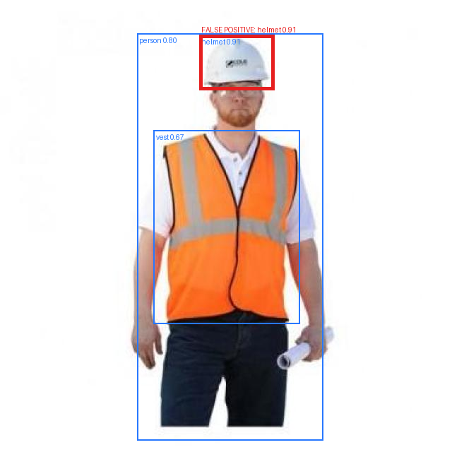
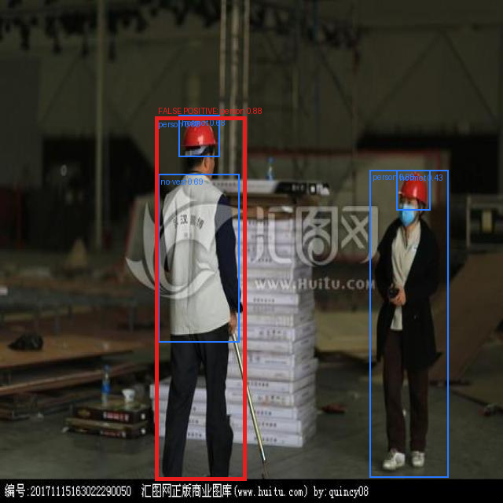
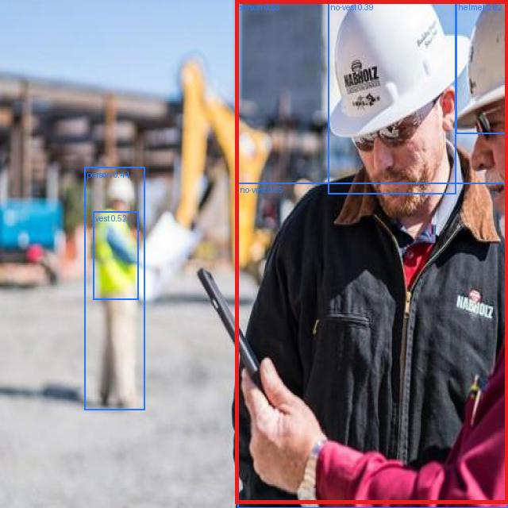
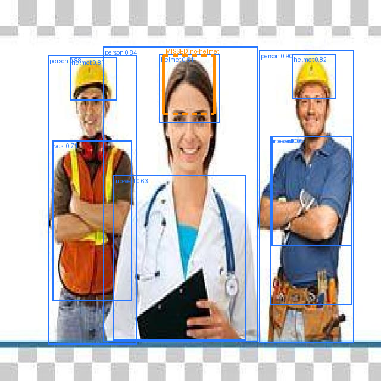
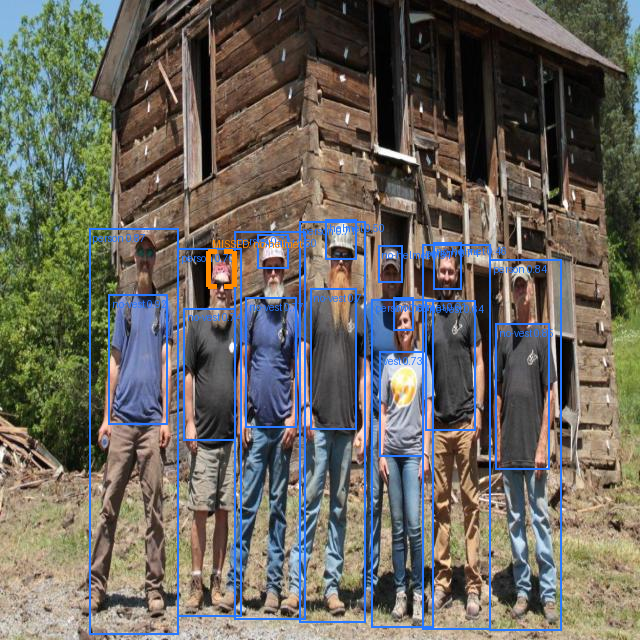
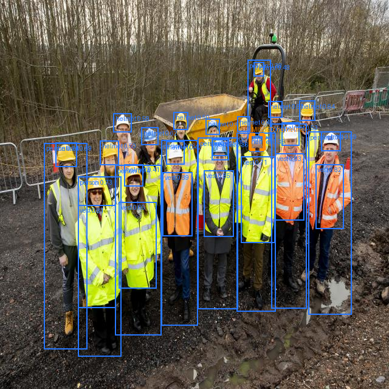

# Error analysis

Method: `best.pt` (epoch 9) evaluated on the 121-image validation split at IoU 0.5, and inspected
visually at confidence 0.35 on a random sample of validation images (`01_Training.ipynb` §6).
Per-class precision and recall come from §5 of the same notebook. Screenshots for each case below
go in [`../results/evidence/`](../results/evidence/).

Vocabulary: **FP** = detected something that is not there · **FN** = missed something that is
there · **class confusion** = right object, wrong label · **localisation error** = right object,
sloppy box.

## Headline finding

The model is accurate overall (mAP@50 0.867) and unreliable exactly where it matters. Recall by
class, ordered:

| Class | Recall | Precision | Val instances |
|---|---|---|---|
| person | 0.919 | 0.864 | 246 |
| helmet | 0.888 | 0.921 | 237 |
| vest | 0.837 | 0.818 | 145 |
| no-vest | 0.746 | 0.764 | 91 |
| **no-helmet** | **0.545** | 0.947 | **11** |

Recall tracks training frequency almost perfectly (6,330 helmet instances → 0.888; 291 no-helmet →
0.545). This is not a modelling failure, it is a dataset failure, and it is fixable with data
rather than with hyperparameters.
The failure cases below narrow this further. Two of the three misses are not about frequency at
all: FN-1 is a bare-headed person in non-construction dress, FN-2 a soft cap. Both suggest
`no-helmet` has learned site context and head-covering-shape rather than the absence of a hard hat.
More instances of the same stock imagery would not fix either. The dataset is largely web-scraped
studio and group photography rather than site or CCTV frames, which is the deployment condition the
README proposes.

---

## False positives

All three highest-confidence "false positives" are, on inspection, correct detections. This is the
most important finding in the error analysis and it changes how the precision figure should be read.

### FP-1 — `helmet` at 0.91 on a worker plainly wearing one

**Observed:** a white hard hat, detected at 0.91, counted against precision.
**Hypothesis:** the ground-truth box is missing or falls below IoU 0.5 against the prediction. The
model is right and the label is wrong.
**Cost:** none operationally. But it means measured precision (0.863) is a floor, not a true value.

### FP-2 — `person` at 0.88 on a person

**Observed:** same pattern as FP-1, on the `person` class.
**Hypothesis:** unlabelled instance. Note also the visible `huitu.com` commercial watermark — the
source dataset contains stock imagery whose provenance is less clean than its CC BY 4.0
declaration implies. Recorded in the governance checklist.

### FP-3 — `person`, box geometry

**Observed:** two foreground workers; the prediction spans a different extent than the ground truth.
**Hypothesis:** localisation, not detection — consistent with mAP@50–95 (0.474) sitting far below
mAP@50 (0.867).

**Implication.** An audit of the validation labels should precede any further training. Part of the
precision gap is label noise, and improvements measured against noisy ground truth cannot be trusted.

---

## False negatives

### FN-1 — bare-headed figure missed on a studio composite

**Observed:** three cut-out figures on a transparent background. `helmet`, `person`, `vest` and
`no-vest` all fire correctly on the two workers; the bare-headed figure in the centre is missed.
**Hypothesis:** she reads as clinical, not construction — white coat, stethoscope, no site context.
`no-helmet` appears to have co-learned site cues rather than the absence of a hard hat.
**Cost:** the class fails precisely where PPE context is absent — which includes anyone entering a
site in street clothes.

### FN-2 — soft cap scored 0.21, below threshold

**Observed:** group portrait; the man at left wears a baseball cap. A near miss, not a cold miss.
**Hypothesis:** the model treats any head covering as helmet-ambiguous and suppresses the
`no-helmet` score rather than committing.
**Cost:** highest-value labelling gap available. Caps, hoods and beanies labelled explicitly as
`no-helmet` is the single cheapest fix in this document.

### FN-3 — dense scene, small heads

**Observed:** twenty-plus people in hi-vis, heads at roughly 30 px.
**Hypothesis:** scale, not semantics. At `imgsz=640` these heads sit near the detector's floor.
**Cost:** a hard operating limit — compliance cannot be assessed beyond a given distance. Tiling
large frames at inference, or raising `imgsz`, addresses it without retraining.

---

## Prioritised next data improvements

Each is a dataset action. The evidence above says capacity is not the binding constraint — the
model stopped improving at epoch 9 and early-stopped at 24 — so more epochs or a larger backbone
would not fix any of this.

1. **Rebalance `no-helmet`: add 300–500 instances, roughly doubling to tripling the class.**
   Targets FN-1, the only failure that matters for the stated use case. Source from other Roboflow
   Universe PPE datasets with a compatible schema, or by mining frames where our model predicts
   `person` with no `helmet` and no `no-helmet` — the ambiguous cases are exactly the ones worth
   labelling. Expected effect: `no-helmet` recall from 0.55 toward 0.80. Effort: ~3 h.
   *Cheap partial fix available immediately: lower the confidence threshold for `no-helmet` only.
   At precision 0.947 there is a lot of headroom to trade precision for recall without drowning the
   supervisor. Measure it on the PR curve before committing.*

2. **Expand the validation set for the rare classes.** 11 `no-helmet` instances in 6 images cannot
   support a claim about recall. Move images from the 84-image test split, or add held-out images,
   until `no-helmet` has 50+ validation instances. This produces no accuracy gain — it makes the
   measurement trustworthy, which is a prerequisite for showing improvement #1 actually worked.
   Effort: ~1 h.

3. **Audit the validation labels.** Targets FP-1 and FP-2, which are unlabelled true instances
   rather than model errors. Until the ground truth is clean, precision cannot be measured and any
   improvement claim rests on noise. Effort: ~2 h.

4. **Add hard negatives for `no-vest` and `helmet`.** Frames containing buckets, cones, drums and
   non-worker bystanders, labelled as background. Expected effect: `no-vest` precision up from
   0.764; fewer helmet look-alikes. Effort: ~2 h.

Explicitly **not** on the list: more epochs, `yolov8s`, heavier augmentation. Validation mAP
plateaued at epoch 9 of 24 — the ceiling here is data coverage, not training.

## Iteration plan

| Version | Change | Metric to watch | Status |
|---|---|---|---|
| v1 | Baseline, `yolov8n`, 50 epochs configured / 24 run | mAP@50 = 0.867 | Done |
| v2 | Improvement 2 (validation support), then 1 (rebalance) | `no-helmet` recall | Planned |
| v3 | Improvement 3 (hard negatives) | `no-vest` precision | Planned |
